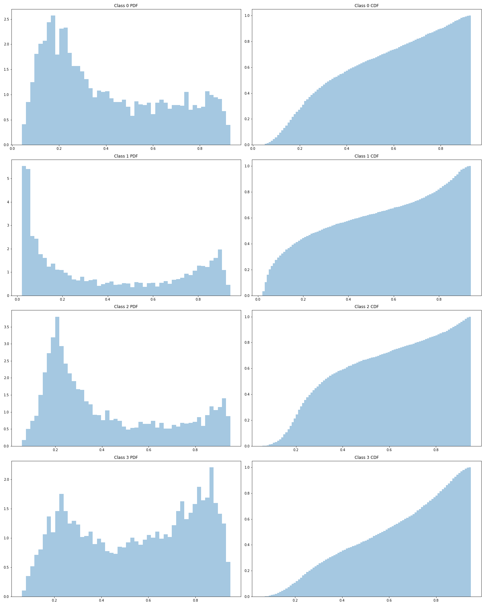

========================================================================================================
`understanding-cloud-organization <https://www.kaggle.com/c/understanding_cloud_organization/overview>`_
========================================================================================================
*Shallow clouds play a huge role in determining the Earth's climate.
They’re also difficult to understand and to represent in climate models.
By classifying different types of cloud organization, researchers at Max Planck hope
to improve our physical understanding of these clouds, which in turn will help us build
better climate models.*

.. contents:: Table of Contents
   :depth: 3

Competition Report
==================

Summary
-------

Results
~~~~~~~
+------+---------+------------+
| Rank |  Score  | Percentile |
+======+=========+============+
|  34  | 0.66385 |  Top 2.2%  |
+------+---------+------------+

Strategy
~~~~~~~~
Originally I had an idea early on very similar to
`this <https://arxiv.org/pdf/1911.04252.pdf>`_ recent paper. I was going to train a
model on the ground truthed data, and then iteratively create pseudo labels for
unlabelled data and train on that. I figured this was a good opportunity for such a
strategy because there was very little training data (~5000 images), so there was a lot
to be gained by generating more training samples. And, because this was not a
synchronous kernel competition, I'd be able to create as large an ensemble as I like.

Then I realised how noisy the image labels were, and wasn't so sure that pseudo labels
would work very well. In particular, I noticed that the validation scores of my models
was super noisy - using the same configuration with a different random seed resulted
in serious metric differences. I figured I would give up on trying to fine tune
individual models and instead focus on engineering a system that would allow me to
train and ensemble *lots* of models.

I developed functionality to allow me to automate the configuration, training, and
inference of models.

I trained an ensemble of ~120 models, using a variety of encoder/decoder combinations.
I first averaged them together by their encoder/decoder combinations (eg. all the
efficientnet-b2 FPN get averaged together). Then I averaged these mini-ensembles
together using a weighted average.

With about a week of the competition to go, I saw the Noisy Student paper. I
was getting decent results on the LB and figured I'd give pseudo labelling a go. I
downloaded ~4200 images using the same resolution and locations as the official data,
generated pseudo labels for them, and trained a new ensemble of ~50 models.

I only finished training the pseudo labelled models in time to make a few submissions
on the final day, and managed to get up to 0.67739 (9th place) on the public LB - but
that actually only scored 0.66331 (~45th) on the private LB. My other selected
submission was a weighted average of my past 25 submissions, which scored 0.67574 on
the public LB and 0.66385 (34th) on the private LB.

I had a few unselected submissions that scored 0.666+ (~18th), the best of which funnily
enough came from a mini-ensemble of only efficientnet-b2-Unet models.

Reflection
~~~~~~~~~~
Looking back I realise I made a pretty big mistake not capturing the appropriate metrics
for thorough local CV. I was only recording dice coefficient using a threshold of 0.5,
and so I wasn't well informed to pick a threshold for my submissions.

Also, while the models were each trained on a random 80% of the data, and evaluated on
the remaining 20%, this was only done at a per-model level. I didn't keep a hold-out
set to validate the ensembles against. Because we only had ~5000 training samples,
I got a bit greedy with training data here.

I was hoping that by keeping logs of all my experiments, after a while I'd be able to
identify which randomly generated configurations (eg. learning rate) worked better than
others. This didn't turn out to be the case! I should have spent more time fine tuning
each model, as the law of diminishing returns was coming into effect as the size of
my ensemble grew.

Details
-------

Ensemble Pipeline
~~~~~~~~~~~~~~~~~
See ``uco.ensemble.py`` for implementation.

Each training experiment is configured using a YAML file which gets loaded into a
dictionary. I set up a class to randomise these parameters, so I could leave it to run
while at work/sleep and it would cycle through different architectures, loss functions,
and other parameters.

After each training epoch the model would be evaluated on a 20% validation set. The
mean dice score was tracked throughout training, and when the training completed
(either after a set number of epochs or early stopping) only the best scoring checkpoint
would be saved. I set a cutoff mean dice score, and threw away models that scored under
that.

The saved checkpoint would be loaded, and run inference on the test data. I saved out
the *raw* (sigmoid) predictions of each model to HDF5. I scaled by 250 and rounded to
integers so I could save as ``uint8`` to save disk space.

These raw predictions would be grouped by (encoder, decoder) pair, and averaged
together weighted by mean dice scores. Then the groups would be averaged together,
with parameterised weights.

By saving out the results at each stage to HDF5 (raw predictions, group averages, and
total averages), I could re-run any part of the pipeline with ease.

I did the above for both segmentation and classification models. The details below
are just for the segmentation models.

Models
~~~~~~
I used `segmentation_models.pytorch <https://github.com/qubvel/segmentation_models.pytorch>`_
(SMP) for segmentation, and used
`pytorch-image-models <https://github.com/rwightman/pytorch-image-models>`_ (TIIM)
for classification.

Encoders
********

- efficientnet B0, B2, B5, B6
- resnext 101_32x8d
- se_resnext 101_32x8d
- inceptionresnet v2, v4
- dpn 131
- densenet 161

Decoders
********
- FPN
- Unet

I had terrible results with LinkNet and PSPNet.

Training
~~~~~~~~

GPU
***
RTX 2080Ti.

Loss
****
I used BCE + Dice with BCE weight ~U(0.65, 0.75) and dice weight 1 - BCE.

I used BCE + Lovasz with BCE weight ~U(0.83, 0.92) and lovasz 1 - BCE.

Learning Rate
*************
Encoder ~U(5e-5, 9e-5)
Decoder ~U(3e-3, 5e-3)

Optimizer
*********
RAdam / `QHAdamW <https://github.com/catalyst-team/catalyst/blob/master/catalyst/contrib/optimizers/qhadamw.py>`_

Augmentation
************
Compositions are in ``data_loader.augmentation.py``.

I made one custom augmentation - I modified Cutout to apply to masks. I wasn't sure if
this would actually be better than only applying Cutout to the image - because the
ground truth bounding boxes were large and covered areas that actually weren't very
cloudy. It wasn't obvious from my experiments which worked better - but they both
helped, so I just added them both to the available random configuration options for
training.

Image Sizes
***********
I wanted to use images sizes divisible by 32 so they would work without rounding
effects, so I used the following which maintained the original 1400:2100 aspect ratio:

- 256x384
- 320x480
- 384x576
- 448x672

Most models were trained using 320x480. I didn't notice any improvement using larger
image sizes, but I figured it might help the ensemble to use diverse sizes.

Pseudo Labels
*************
I used my ensemble trained on the official training data to predict masks for the ~4000
images I downloaded. I then removed any images without masks, and trained on the rest.

In contrast to some of the other people that used pseudo labels, I did not make my
thresholds harsher for selecting pseudo labels. My rationale was that since most images
included 2+ classes, increasing the thresholds to be 'safe' would likely mean missing
the 2nd class in many images - leading to lots of false negative labels in my pseudo
labels.

I used a `balanced sampler <https://github.com/khornlund/pytorch-balanced-sampler>`_ to
include 4 pseudo labelled samples per batch (typically batch sizes were 10-16).

Post-Processing
~~~~~~~~~~~~~~~

TTA
***
I used flips from `TTAch <https://github.com/qubvel/ttach>`_.

Segmentation Thresholds
***********************
I experimented with a bunch of different ways to threshold positive predictions, as
the dice metric penalises false positives so heavily.

I started out by using the following threshold rule:

1. Outputs must have N pixels above some *top threshold*. I started out using N ~ 8000
for each class, and a top threshold of ~0.57.
2. For predictions that pass (1), produce a binary mask using *bot threshold* of ~0.4.

I used the continuous output of the classifier to modulate these thresholds. Ie. if the
classifier was high, I would reduce the min size requirement, or the top threshold.

In the end I simply used maximum pixel prediction and no min size.

The distribution of predictions for the different classes is actually pretty
interesting:

Class 1 has very nice bimodal distribution. This suggests it was the easiest to learn.

Usage
=====

Folder Structure
----------------

::

  understanding-cloud-organization/
  │
  ├── uco/
  │    │
  │    ├── cli.py - command line interface
  │    ├── ensemble.py - automated training + inference loop, config randomisation
  │    ├── h5.py - reading/writing predictions to HDF5
  │    ├── runner.py - handles a single training or inference run
  │    │
  │    ├── base/ - abstract base classes
  │    │   ├── base_data_loader.py - abstract base class for data loaders
  │    │   ├── base_model.py - abstract base class for models
  │    │   └── base_trainer.py - abstract base class for trainers
  │    │
  │    ├── data_loader/ - anything about data loading goes here
  │    │   ├── augmentation.py
  │    │   ├── data_loaders.py
  │    │   ├── datasets.py
  │    │   ├── process.py
  │    │   ├── pseudo.py
  │    │   └── sampler.py
  │    │
  │    ├── download/ - download unlabelled images from NASA
  │    │   └── gibs.py
  │    │
  │    ├── model/ - models, losses, and metrics
  │    │   ├── loss.py
  │    │   ├── metric.py
  │    │   ├── model.py
  │    │   ├── optimizer.py
  │    │   └── scheduler.py
  │    │
  │    ├── trainer/ - trainers
  │    │   └── trainer.py
  │    │
  │    └── utils/
  │
  ├── logging.yml
  ├── data/
  ├── experiments/ - configuration files
  ├── saved/ - checkpoints and logs
  └── scripts/ - shell scripts to setup repo & download official data

Environment
-----------
Create and activate the ``Anaconda`` environment using:

.. code-block::

  $ conda env create --file environment.yml
  $ conda activate uco

Note that the models used here are in a mirror/fork of
`SMP <https://github.com/khornlund/segmentation-models-pytorch>`_. If you want to use
the same models, you'll need to clone this and install it using:

.. code-block:: bash

  $ git clone git@github.com:khornlund/segmentation-models-pytorch.git
  $ cd segmentation-models-pytorch/
  $ git checkout efficietnet
  $ pip install -e .

Download
--------
You can download the data using ``scripts/setup-data.sh``. Note this assumes you have your
``kaggle.json`` token set up to use the
`Kaggle API <https://github.com/Kaggle/kaggle-api>`_.

The images for pseudo labelling can be downloaded using:

.. code-block::

  $ uco download-gibs

After that's complete, run ``scripts/setup-pseudo.sh``.

Training
--------
You can run an experiment using a single config file using:

.. code-block::

  $ uco train -c experiments/path/to/config.yml

Or start training an ensemble using :

.. code-block::

  $ uco train-ensemble [args]

Post-Processing
---------------

.. code-block::

  $ uco predict-all [args]
  $ uco average [args]
  $ uco post-process [args]
  $ uco submit [args]

Tensorboard Visualization
--------------------------
This project supports `<https://pytorch.org/docs/stable/tensorboard.html>`_ visualization.

1. Run training

    Set ``tensorboard`` option in config file true.

2. Open tensorboard server

    Type ``tensorboard --logdir saved/`` at the project root, then server will open at
    ``http://localhost:6006``

Acknowledgments
===============
This project uses the
`Cookiecutter PyTorch <https://github.com/khornlund/cookiecutter-pytorch>`_ template.

Various code has been copied from Github or Kaggle. In general I put in the docstring
where I copied it from, but if I haven't referenced it properly I apologise.
